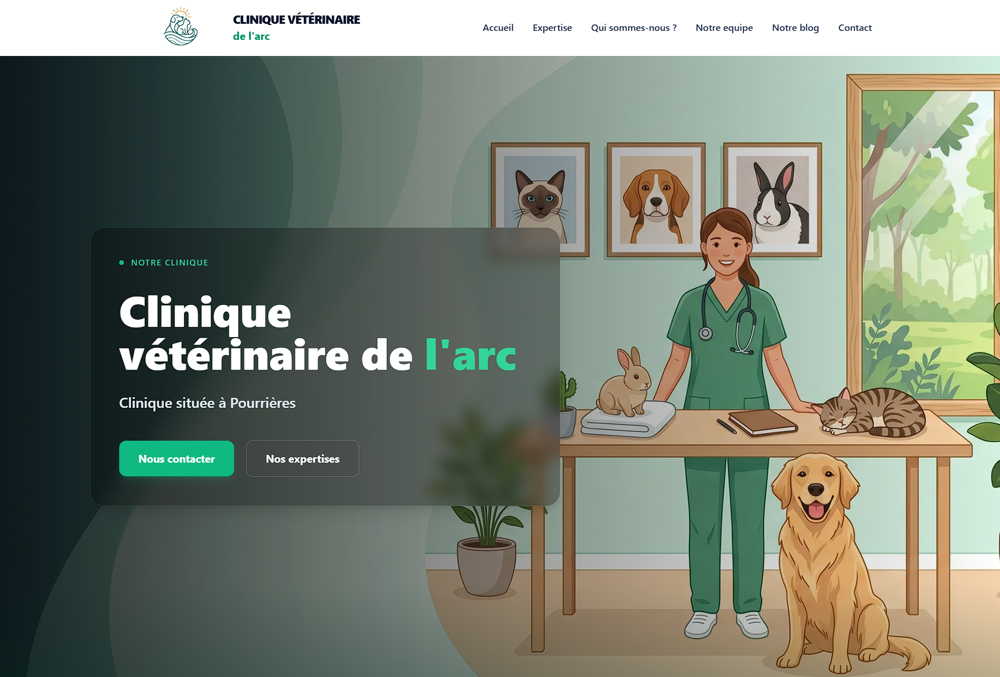
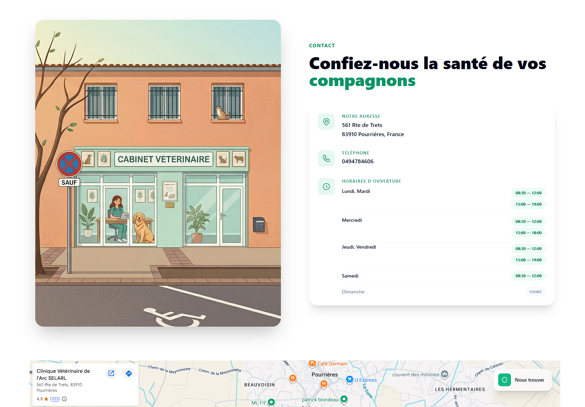
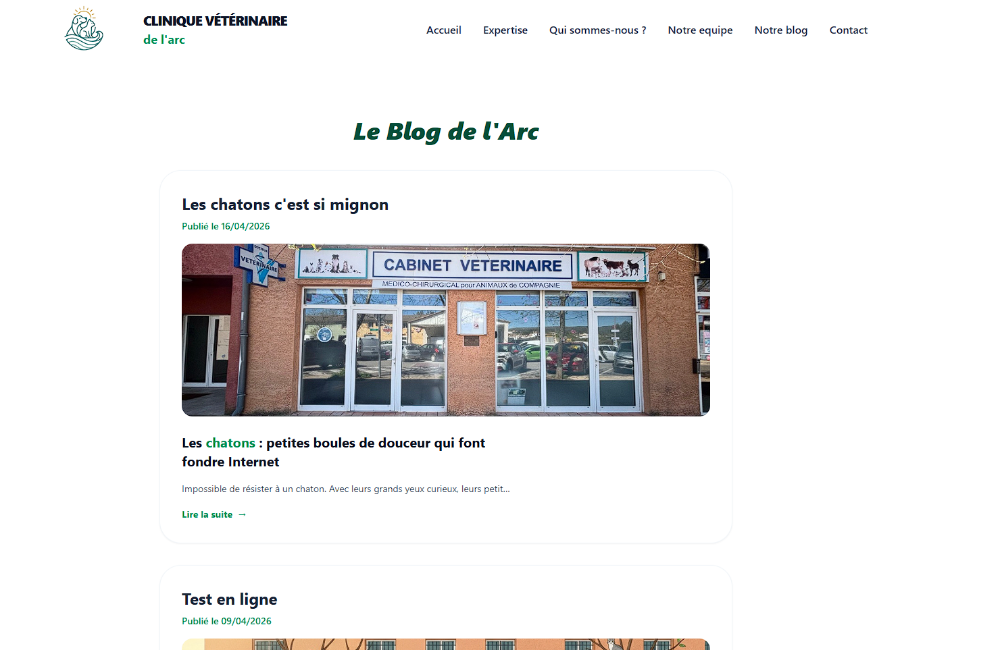
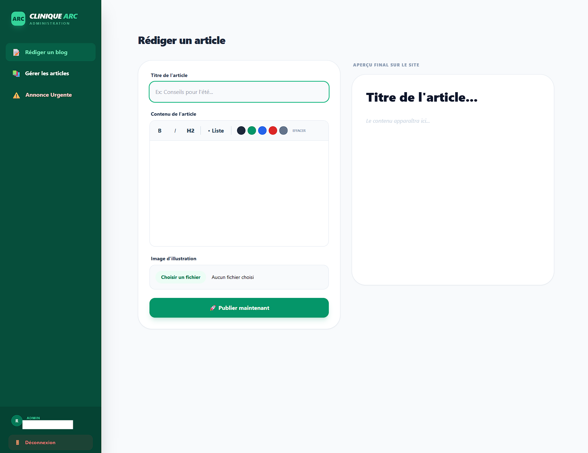
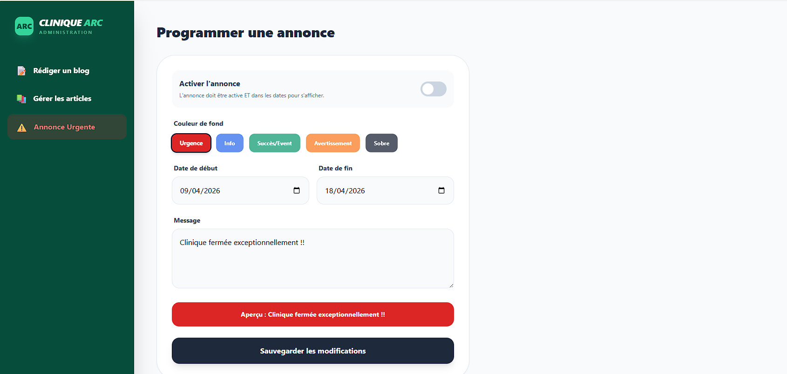

# 🐾 Clinique Vétérinaire de l'Arc

> Une expérience numérique moderne, fluide et rassurante dédiée au bien-être animal.

Ce projet est une plateforme web vitrine développée pour la **Clinique Vétérinaire de l'Arc** (Pourrières). L'objectif est d'allier une interface utilisateur (UI) luxueuse et épurée à une performance technique irréprochable, reflétant l'expertise médicale et la bienveillance de l'équipe.

---

## ✨ Caractéristiques du Projet

* **Design Glassmorphism :** Utilisation de flous d'arrière-plan et de transparences pour un look "Apple-style" moderne et professionnel.
* **Système d'Annonces Dynamique :** Gestion des urgences en temps réel avec programmation de dates (début/fin) et choix de couleurs (Urgence, Info, Succès) via Firebase.
* **Espace Admin Sécurisé :** Interface sur mesure pour la rédaction d'articles de blog et la gestion des alertes, avec persistance de session sécurisée (1h max).
* **Expérience Fluide :** Animations fluides, transitions "beurre fondu" et scroll doux (Smooth Scroll) pour une navigation apaisante.
* **Architecture Mobile-First :** Entièrement responsive, optimisé pour une consultation rapide sur smartphone.

---

## 🛠 Technologies Utilisées

Le projet repose sur une stack technologique moderne et performante :

| Technologie | Usage |
| :--- | :--- |
| **Nuxt 3** | Framework Vue.js haute performance avec rendu hybride. |
| **Tailwind CSS** | Framework utilitaire pour un design sur mesure et ultra-léger. |
| **Firebase** | Firestore (BDD), Authentication (Sécurité), Oauth google & Storage (Images). |
| **Vercel** | Hébergement Cloud et déploiement continu (CI/CD). |

---

## 🌍 Déploiement & Mise en ligne

Le site est configuré pour un déploiement automatisé via **Vercel** et lié au domaine **OVH**.

### Sécurité & SEO
- **Domaines autorisés :** `clinique-veterinaire-de-larc.fr` est ajouté dans la console Firebase (Auth).
- **Indexation :** Métadonnées optimisées pour la recherche locale "Vétérinaire Pourrières".

---

## 📄 Licence

Ce projet est la propriété exclusive de la **Clinique Vétérinaire de l'Arc**. Toute reproduction ou utilisation commerciale des visuels et du logo est interdite sans autorisation préalable.

---

## Quelques images 

Blog :

### Backoffice

*Développé avec ❤️ pour nos amis les bêtes.*